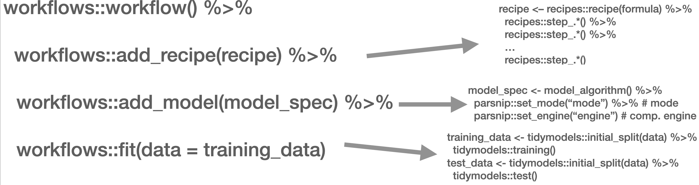

# Machine Learning {#day5}

In the following script, we will introduce you to the supervised and unsupervised classification of text. Supervised means that we will need to "show" the machine a data set that already contains the value or label we want to predict (the "dependent variable") as well as all the variables that are used to predict the class/value (the independent variables or, in ML lingo, *features*). In the examples we will showcase, the features are the tokens that are contained in a document. Dependent variables are in our example sentiment.

Overall, the process of supervised classification using text in R encompasses the following steps: 

1. Split data into training and test set
2. Pre-processing and featurization
3. Training
4. Evaluation and tuning (through cross-validation)
(… repeat 2.-4. as often as necessary)
5. Applying the model to the held-out test set
6. Final evaluation

This is mirrored in the `workflow()` function from the `workflows` [@vaughan_workflows_2022] package. There, you define the pre-processing procedure (`add_recipe()` -- created through the `recipe()` function from the `recipes` [@kuhn_recipes_2022] and/or `textrecipes` [@hvitfeldt_textrecipes_2022] package(s)), the model specification with `add_spec()` -- taking a model specification as created by the `parsnip` [@kuhn_parsnip_2022] package.



In the next part, other approaches such as Support Vector Machines (SVM), penalized logistic regression models (penalized here means, loosely speaking, that insignificant predictors which contribute little will be shrunk and ignored -- as the text contains many tokens that might not contribute much, those models lend themselves nicely to such tasks), random forest models, or XGBoost will be introduced. Those approaches are not to be explained in-depth, third-party articles will be linked though, but their intuition and the particularities of their implementation will be described. Since we use the `tidymodels` [@kuhn_tidymodels_2020] framework for implementation, trying out different approaches is straightforward. Also, the pre-processing differs, `recipes` and `textrecipes` facilitate this task decisively. Third, the evaluation of different classifiers will be described. Finally, the entire workflow will be demonstrated using the abortion Tweet data set.

## Split data 

The example for today's session is the IMDb data set. First, we load a whole bunch of packages and the data set.

```{r message=FALSE, warning=FALSE}
library(tidymodels)
library(textrecipes)
library(workflows)
library(discrim)
library(glmnet)
library(tidytext)
library(tidyverse)

imdb_data <- read_csv("https://www.dropbox.com/s/0cfr4rkthtfryyp/imdb_reviews.csv?dl=1")
```

The first step is to divide the data into training and test sets using `initial_split()`. You need to make sure that the test and training set are fairly balanced which is achieved by using `strata =`. `prop =` refers to the proportion of rows that make it into the training set.

```{r}
split <- initial_split(imdb_data, prop = 0.8, strata = sentiment)

imdb_train <- training(split)
imdb_test <- testing(split)

glimpse(imdb_train)
imdb_train %>% count(sentiment)
```

## Pre-processing and featurization

In the `tidymodels` framework, pre-processing and featurization are performed through so-called `recipes`. For text data, so-called `textrecipes` are available. 

### `textrecipes` -- basic example

In the initial call, the formula needs to be provided. In our example, we want to predict the sentiment ("positive" or "negative") using the text in the review. Then, different steps for pre-processing are added. Similar to what you have learned in the prior chapters containing measures based on the bag of words assumption, the first step is usually tokenization, achieved through `step_tokenize()`. In the end, the features need to be quantified, either through `step_tf()`, for raw term frequencies, or `step_tfidf()`, for TF-IDF. In between, various pre-processing steps such as word normalization (i.e., stemming or lemmatization), and removal of rare or common words Hence, a recipe for a very basic model just using raw frequencies and the 1,000 most common words would look as follows:

```{r}
imdb_basic_recipe <- recipe(sentiment ~ text, data = imdb_train) %>% 
  step_tokenize(text) %>% # tokenize text
  step_tokenfilter(text, max_tokens = 1000) %>% # only retain 1000 most common words
  # additional pre-processing steps can be added, see next chapter
  step_tf(text) # final step: add term frequencies
```

In case you want to know what the data set for the classification task looks like, you can `prep()` and finally `bake()` the recipe. Note that we need to specify the data set we want to pre-process in the recipe's manner. In our case, we want to perform the operations on the data specified in the `basic_recipe` and, hence, need to specify `new_data = NULL`.

```{r}
imdb_basic_recipe %>% 
  prep() %>% 
  bake(new_data = NULL)
```

### `textrecipes` -- further preprocessing steps

More steps exist. These always follow the same structure: their first two arguments are the recipe (which in practice does not matter, because they are generally used in a "pipeline") and the variable that is affected (in our example "text" because it is the one to be modified). The rest of the arguments depends on the function. In the following, we will briefly list them and their most important arguments. Find the exhaustive list [here](https://cran.r-project.org/web/packages/textrecipes/textrecipes.pdf),

* `step_tokenfilter()`: filters tokens
  + `max_times =` upper threshold for how often a term can appear (removes common words)
  + `min_times =` lower threshold for how often a term can appear (removes rare words)
  + `max_tokens =` maximum number of tokens to be retained; will only keep the ones that appear the most often
  + you should filter before using `step_tf` or `step_tfidf` to limit the number of variables that are created
* `step_lemma()`: allows you to extract the lemma
  + in case you want to use it, make sure you tokenize via `spacyr` (by using `step_tokenize(text, engine = "spacyr"))`
* `step_pos_filter()`: adds the Part-of-speech tags
  + `keep_tags =` character vector that specifies the types of tags to retain (default is "NOUN", for more details see [here](https://github.com/explosion/spaCy/blob/master/spacy/glossary.py) or consult chapter \@ref(day4))
  + in case you want to use it, make sure you tokenize via `spacyr` (by using `step_tokenize(text, engine = "spacyr"))`
* `step_stem()`: stems tokens 
  + `custom_stem =` specifies the stemming function. Defaults to `SnowballC`. Custom functions can be provided.
  + `options =` can be used to provide arguments (stored as named elements of a list) to the stemming function. E.g., `step_stem(text, custom_stem = "SnowballC", options = list(language = "russian"))`
* `step_stopwords()`: removes stopwords
  + `source =` alternative stopword lists can be used; potential values are contained in `stopwords::stopwords_getsources()`
  + `custom_stopword_source =` provide your own stopword list
  + `language =` specify language of stop word list; potential values can be found in `stopwords::stopwords_getlanguages()`
* `step_ngram()`: takes into account order of terms, provides more context
  + `num_tokens =` number of tokens in n-gram -- defaults to 3 -- trigrams
  + `min_num_tokens =` minimal number of tokens in n-gram -- `step_ngram(text, num_tokens = 3, min_num_tokens = 1)` will return all uni-, bi-, and trigrams.
* `step_word_embeddings()`: use pre-trained embeddings for words
  + `embeddings()`: tibble of pre-trained embeddings
* `step_normalize()`: performs unicode normalization as a preprocessing step
  + `normalization_form =` which Unicode Normalization to use, overview in [`stringi::stri_trans_nfc()`](https://www.rdocumentation.org/packages/stringi/versions/1.7.6/topics/stri_trans_nfc)
* `themis::step_upsample()` takes care of unbalanced dependent variables (which need to be specified in the call)
  + `over_ratio =` ratio of desired minority-to-minority frequencies

## Model specification

Now that the data is ready, the model can be specified. The `parsnip` package is used for this. It contains a model specification, the type, and the engine. For Naïve Bayes, this would look like the following (note that you will need to install the relevant packages -- here: `discrim` -- before using them): 

```{r}
nb_spec <- naive_Bayes() %>% # the initial function, coming from the parsnip package
  set_mode("classification") %>% # classification for discrete values, regression for continuous ones
  set_engine("naivebayes") # needs to be installed
```

Other model specifications you might deem relevant:

* Logistic regression

```{r}
lr_spec <- logistic_reg() %>%
  set_engine("glm") %>%
  set_mode("classification")
```

* Logistic regression (penalized with Lasso):

```{r}
lasso_spec <- logistic_reg(mixture = 1) %>%
  set_engine("glm") %>%
  set_mode("classification") 
```

* SVM (here, `step_normalize(all_predictors())` needs to be the last step in the recipe)

```{r}
svm_spec <- svm_linear() %>%
  set_mode("regression") %>% # can also be "classification"
  set_engine("LiblineaR")
```

* Random Forest (with 1000 decision trees):

```{r}
rf_spec <- rand_forest(trees = 1000) %>%
  set_engine("ranger") %>%
  set_mode("regression") # can also be "classification"
```

* xgBoost (with 20 decision trees):

```{r}
xg_spec <- boost_tree(trees = 20) %>% 
  set_engine("xgboost") %>%
  set_mode("regression") # can also be classification
```

## Model training -- `workflows`

A workflow can be defined to train the model. It will contain the recipe, hence taking care of the pre-processing, and the model specification. In the end, it can be used to fit the model.

```{r}
imdb_nb_wf <- workflow() %>% 
  add_recipe(imdb_basic_recipe) %>% 
  add_model(nb_spec)
```

It can then be fit using `fit()`.

```{r}
imdb_nb_basic <- imdb_nb_wf %>% fit(data = imdb_train)
```


## Model evaluation

Now that a first model has been trained, its performance can be evaluated. In theory, we have a test set for this. However, the test set is precious and should only be used once we are sure that we have found a good model. Hence, for these intermediary tuning steps, we need to come up with another solution. So-called cross-validation lends itself nicely to this task. The rationale behind it is that chunks from the training set are used as test sets. So, in the case of 10-fold cross-validation, the test set is divided into 10 distinctive chunks of data. Then, 10 models are trained on the respective 9/10 of the training set that is not used for evaluation. Finally, each model is evaluated against the respective held-out "test set" and the performance metrics averaged.


First, the folds need to be determined. we set a seed in the beginning to ensure reproducibility.
```{r}
library(tune)

set.seed(123)
imdb_folds <- vfold_cv(imdb_train)
```

`fit_resamples()` trains models on the respective samples. (Note that for this to work, no model must have been fit to this workflow before. Hence, you either need to define a new workflow first or restart the session and skip the fit-line from before.)

```{r eval=FALSE}
imdb_nb_resampled <- fit_resamples(
  imdb_nb_wf,
  imdb_folds,
  control = control_resamples(save_pred = TRUE),
  metrics = metric_set(accuracy, recall, precision)
)
```

```{r eval=TRUE, include=FALSE}
imdb_nb_resampled <- read_rds("https://www.dropbox.com/s/hulz4m6g3xrkemv/imdb_nb_resampled.rds?dl=1")
```

`collect_metrics()` can be used to evaluate the results. 

* Accuracy tells me the share of correct predictions overall
* Precision tells me the number of correct positive predictions
* Recall tells me how many actual positives are predicted properly

In all cases, values close to 1 are better. 

`collect_predictions()` will give you the predicted values. 

```{r}
nb_rs_metrics <- collect_metrics(imdb_nb_resampled)
nb_rs_predictions <- collect_predictions(imdb_nb_resampled)
```

This can also be used to create the confusion matrix by hand.

```{r}
confusion_mat <- nb_rs_predictions %>% 
  group_by(id) %>% 
  mutate(confusion_class = case_when(.pred_class == "positive" & sentiment == "positive" ~ "TP",
                                     .pred_class == "positive" & sentiment == "negative" ~ "FP",
                                     .pred_class == "negative" & sentiment == "negative" ~ "TN",
                                     .pred_class == "negative" & sentiment == "positive" ~ "FN")) %>% 
  count(confusion_class) %>% 
  ungroup() %>% 
  pivot_wider(names_from = confusion_class, values_from = n)
```

Now you can go back and adapt the pre-processing recipe, fit a new model, or try a different classifier, and evaluate it against the same set of folds. Once you are satisfied, you can proceed to check the workflow on the held-out test data. 

### Hyperparameter tuning

Some models also require the tuning of hyperparameters (for instance, lasso regression). If we wanted to tune these values, we could do so using the `tune` package. There, the parameter that needs to be tuned gets a placeholder in the model specification. Through variation of the placeholder, the optimal solution can be empirically determined.

So, in the first example, we will try to determine a good penalty value for LASSO regression. 

```{r}
lasso_tune_spec <- logistic_reg(penalty = tune(), mixture = 1) %>%
  set_mode("classification") %>%
  set_engine("glmnet")
```

we will also play with the numbers of tokens to be included:

```{r}
imdb_tune_basic_recipe <- recipe(sentiment ~ text, data = imdb_train) %>% 
  step_tokenize(text) %>%
  step_tokenfilter(text, max_tokens = tune()) %>% 
  step_tf(text)
```

The `dials` [@kuhn_dials_2022] package provides the handy `grid_regular()` function which chooses suitable values for certain parameters. 

```{r}
lambda_grid <- grid_regular(
  penalty(range = c(-4, 0)), 
  max_tokens(range = c(1e3, 2e3)),
  levels = c(penalty = 3, max_tokens = 2)
)
```

Then, we need to define a new workflow, too. 

```{r}
lasso_tune_wf <- workflow() %>% 
  add_recipe(imdb_tune_basic_recipe) %>%
  add_model(lasso_tune_spec)
```

For the resampling, we can use tune_grid() which will use the workflow, a set of folds (we use the ones we created earlier), and a grid containing the different parameters. 

```{r eval=FALSE}
set.seed(123)

tune_lasso_rs <- tune_grid(
  lasso_tune_wf,
  imdb_folds,
  grid = lambda_grid,
  metrics = metric_set(accuracy, sensitivity, specificity)
)
```

```{r include=FALSE}
tune_lasso_rs <- read_rds("https://www.dropbox.com/s/pbkeugsbzw7pgh2/tuned_lasso.rds?dl=1")
```


Again, we can access the resulting metrics using `collect_metrics()`:

```{r}
collect_metrics(tune_lasso_rs)
```

`autoplot()` can be used to visualize them:

```{r}
autoplot(tune_lasso_rs) +
  labs(
    title = "Lasso model performance across 3 regularization penalties"
  )
```

Also, we can use `show_best()` to look at the best result. Subsequently, `select_best()` allows me to choose it. In real life, we would choose the best trade-off between a model as simple and as good as possible. Using `select_by_pct_loss()`, we choose the one that performs still more or less on par with the best option (i.e., within 2 percent accuracy) but is considerably simpler. Finally, once we are satisfied with the outcome, we can `finalize_workflow()` and fit the final model to the test data.

```{r}
show_best(tune_lasso_rs, "accuracy")

final_lasso_imdb <- finalize_workflow(lasso_tune_wf, select_by_pct_loss(tune_lasso_rs, metric = "accuracy", -penalty))
```

## Final fit

Now we can finally fit our model to the training data and predict on the test data. `last_fit()` is the way to go. It takes the workflow and the split (as defined by `initial_split()`) as parameters.

```{r}
final_fitted <- last_fit(final_lasso_imdb, split)

collect_metrics(final_fitted)

collect_predictions(final_fitted) %>%
  conf_mat(truth = sentiment, estimate = .pred_class) %>%
  autoplot(type = "heatmap")
```


## Latent Dirichlet Allocation (LDA)

In the former section, I, first, explored how the sentiment in the SOTU addresses has evolved over the 20th century. Then, we looked at the decade-specific vocabulary. This, paired with previous knowledge of what happened throughout the 20th century, sufficed to gain some sort of insight. However, another approach to infer meaning from text is to search it for topics. This is also possible with the SOTU corpus which we have at hand.

The two main assumptions of LDA are as follows:

-   Every document is a mixture of topics.
-   Every topic is a mixture of words.

Hence, singular documents do not necessarily be distinct in terms of their content. They can be related -- if they contain the same topics. This is more in line with natural language use.

The following graphic depicts a flowchart of text analysis with the `tidytext` package.


What becomes evident is that the actual topic modeling does not happen within `tidytext`. For this, the text needs to be transformed into a document-term-matrix and then passed on to the `topicmodels` package [@grun_topicmodels_2020], which will take care of the modeling process. Thereafter, the results are turned back into a tidy format, using `broom` so that they can be visualized using `ggplot2`.

### Document-term matrix

To search for the topics which are prevalent in the singular addresses through LDA, we need to transform the tidy tibble into a document-term matrix first. This can be achieved with `cast_dtm()`.

```{r}
library(sotu)
library(tidytext)
library(SnowballC)

sotu_clean <- sotu_meta %>% 
  mutate(text = sotu_text %>% 
           str_replace_all("[,.]", " ")) %>% 
  filter(between(year, 1900, 2000)) %>% 
  unnest_tokens(output = token, input = text) %>% 
  anti_join(get_stopwords(), by = c("token" = "word")) %>% 
  filter(!str_detect(token, "[:digit:]")) %>% 
  mutate(token = wordStem(token, language = "en"))

sotu_dtm <- sotu_clean %>% 
  filter(str_length(token) > 1) %>% 
  count(year, token) %>% 
  #filter(between(year, 1900, 2000)) %>% 
  group_by(token) %>% 
  filter(n() < 95) %>% 
  cast_dtm(document = year, term = token, value = n)
```

A DTM contains  Documents (rows) and Terms (columns) and specifies how often a term appears in a document.

```{r}
sotu_dtm %>% as.matrix() %>% .[1:5, 1:5]
```

### Inferring the number of topics

We need to tell the model in advance how many topics we assume to be present within the document. Since we have neither read all the SOTU addresses (if so, we would hardly need to use the topic model), we cannot make an educated guess on how many topics are in there.

#### Making guesses

One approach might be to just provide it with wild guesses on how many topics might be in there and then try to make sense of them afterward.

```{r include=FALSE}
sotu_lda_k10_tidied <- read_rds("https://www.dropbox.com/s/lxrcy44aqz16sgb/sotu_lda_k10.rds?dl=1")
```

```{r eval=FALSE}
library(topicmodels)
library(broom)

sotu_lda_k10 <- LDA(sotu_dtm, k = 10, control = list(seed = 123))

sotu_lda_k10_tidied <- tidy(sotu_lda_k10)
```

The `tidy()` function from the `broom` package [@robinson_broom_2020] brings the LDA output back into a tidy format. It consists of three columns: the topic, the term, and `beta`, which is the probability that the term stems from this topic. 

```{r}
sotu_lda_k10_tidied %>% glimpse()
```

Now, we can wrangle it a bit, and then visualize it with `ggplot2`.

```{r}
top_terms_k10 <- sotu_lda_k10_tidied %>%
  group_by(topic) %>%
  slice_max(beta, n = 5, with_ties = FALSE) %>%
  ungroup() %>%
  arrange(topic, -beta)

top_terms_k10 %>%
  mutate(topic = factor(topic),
         term = reorder_within(term, beta, topic)) %>%
  ggplot(aes(term, beta, fill = topic)) +
  geom_bar(stat = "identity", show.legend = FALSE) +
  scale_x_reordered() +
  facet_wrap(~topic, scales = "free", ncol = 2) +
  coord_flip()
```

Now the hard part begins: inductively making sense of it. But, of course, there is a large probability that we just chose the wrong number of topics. Therefore, before scratching our heads trying to come to meaningful conclusions, we should first assess what the optimal number of topics is.

#### More elaborate methods

LDA offers a couple of parameters to tune, but the most crucial one probably is `k`, the number of topics. 

```{r}
library(ldatuning)
```

```{r eval=FALSE}
determine_k <- FindTopicsNumber(
  sotu_dtm,
  topics = seq(from = 2, to = 30, by = 1),
  metrics = c("Griffiths2004", "CaoJuan2009", "Arun2010", "Deveaud2014"),
  method = "Gibbs",
  control = list(seed = 77),
  mc.cores = 16L,
  verbose = TRUE
)

determine_k %>% write_rds("lda_tuning.rds")
```

```{r include=FALSE}
determine_k <- read_rds("https://www.dropbox.com/s/1jtehujx1b6f0rp/lda_tuning.rds?dl=1")
```

```{r}
FindTopicsNumber_plot(determine_k)
```

We would go with the 16 topics here, as they seem to maximize the metrics that shall be maximized and minimizes the other ones quite well. 

```{r eval=FALSE}
sotu_lda_k16 <- LDA(sotu_dtm, k = 16, control = list(seed = 77))

sotu_lda_k16_tidied <- tidy(sotu_lda_k16)

write_rds(sotu_lda_k16, "lda_16.rds")
```

```{r include=FALSE}
library(topicmodels)
sotu_lda_k16 <- read_rds("https://www.dropbox.com/s/ffq762eq7ytzyb8/lda_16.rds?dl=1")
sotu_lda_k16_tidied <- tidy(sotu_lda_k16)
```

### Sense-making

Now, the harder part begins: making sense of the different topics. In LDA, words can exist across topics, making them not perfectly distinguishable. Also, as the number of topics becomes greater, plotting them doesn't make too much sense anymore. 

```{r}
topic_list <- sotu_lda_k16_tidied %>% 
  group_by(topic) %>% 
  group_split() %>% 
  map_dfc(~.x %>% 
            slice_max(beta, n = 20, with_ties = FALSE) %>%
            arrange(-beta) %>% 
            select(term)) %>% 
  set_names(str_c("topic", 1:16, sep = "_"))
```

### Document-topic probabilities

Another thing to assess is document-topic probabilities `gamma`: which document belongs to which topic. By doing so, you can choose the documents that have the highest probability of belonging to a topic and then read these specifically. This might give you a better understanding of what the different topics might imply. 

```{r}
sotu_lda_k16_document <- tidy(sotu_lda_k16, matrix = "gamma")
```

This shows you the proportion of words in the document which were drawn from the specific topics. In 1990, for instance, many words were drawn from the first topic.

```{r}
sotu_lda_k16_document %>% 
  group_by(document) %>% 
  slice_max(gamma, n = 1) %>% 
  mutate(gamma = round(gamma, 3))
```

An interesting pattern is that the topics show some time-dependency. This intuitively makes sense, as they might represent some sort of deeper underlying issue.

#### `LDAvis`

`LDAvis` is a handy tool we can use to inspect our model visually. Preprocessing the data is a bit tricky though, therefore we define a quick function first.

```{r}
library(LDAvis)

prep_lda_output <- function(dtm, lda_output){
  doc_length <- dtm %>% 
    as.matrix() %>% 
    as_tibble() %>% 
    rowwise() %>% 
    summarize(doc_sum = c_across() %>% sum()) %>% 
    pull(doc_sum)
  phi <- posterior(lda_output)$terms %>% as.matrix()
  theta <- posterior(lda_output)$topics %>% as.matrix()
  vocab <- colnames(dtm)
  term_sums <- dtm %>% 
    as.matrix() %>% 
    as_tibble() %>% 
    summarize(across(everything(), ~sum(.x))) %>% 
    as.matrix()
  svd_tsne <- function(x) tsne::tsne(svd(x)$u)
  LDAvis::createJSON(phi = phi, 
                     theta = theta,
                     vocab = vocab,
                     doc.length = doc_length,
                     term.frequency = term_sums[1,],
                     mds.method = svd_tsne
  )
}

json_lda <- prep_lda_output(sotu_dtm, sotu_lda_k16)
```

```{r eval=FALSE}
serVis(json_lda, out.dir = 'vis', open.browser = TRUE)

servr::daemon_stop(1)
```

### Structural Topic Models

Structural Topic Models offer a framework for incorporating metadata into topic models. In particular, you can have these metadata affect the *topical prevalence*, i.e., the frequency a certain *topic* is discussed can vary depending on some observed non-textual property of the document. On the other hand, the topical content, i.e., the terms that constitute topics, may vary depending on certain covariates.

Structural Topic Models are implemented in R via a dedicated package. The following overview provides information on the workflow and the functions that facilitate it. 


In the following example, I will use the State of the Union addresses to run you through the process of training and evaluating an STM. 

```{r}
library(stm)

sotu_stm <- sotu_meta %>% 
  mutate(text = sotu_text) %>% 
  distinct(text, .keep_all = TRUE) %>% 
  filter(between(year, 1900, 2000))
```

The package requires a particular data structure and has included several functions that help you preprocess your data. `textProcessor()` takes care of preprocessing the data. It takes as a first argument the text as a character vector as well as the tibble containing the metadata. Its output is a list containing a document list containing word indices and counts, a vocabulary vector containing words associated with these word indices, and a data.frame containing associated metadata. `prepDocuments()` finally brings the resulting list into a shape that is appropriate for training an STM. It has certain threshold parameters which are geared towards further reducing the vocabulary. `lower.thresh = n` removes words that are not present in at least n documents, `upper.thresh = m` removes words that are present in more than m documents. The ramifications of these parameter settings can be explored graphically using the `plotRemoved()` function.

```{r}
processed <- textProcessor(sotu_stm$text, metadata = sotu_stm %>% select(-text))
#, custompunctuation = "-")
#?textProcessor() # check out the different arguments 

#?prepDocuments()

plotRemoved(processed$documents, lower.thresh = seq(1, 50, by = 2))

prepped_docs <- prepDocuments(processed$documents, processed$vocab, processed$meta, lower.thresh = 3, upper.thresh = 80)
```

Now that the data is properly preprocessed and prepared, we can estimate the actual model. As mentioned before, covariates can influence topical prevalence as well as their content. I assume topical prevalence to be influenced by the party of the speaker as well as the year the SOTU was held. The latter is assumed to influence the topical prevalence in a non-linear way (SOTU addresses usually deal with acute topics which do not gradually build over time) and is therefore estimated with a spline through the `s()` function that comes from the `stm` package. It defaults to a spline with 10 degrees of freedom. Moreover, I assume the content of topics to be influenced by party affiliation. Both `prevalence =` and `content =` take their arguments in formula notation.

As determined before, I assume the presence of `K = 16` topics (`stm` also offers the `searchK()` function to tune this hyperparameter)

```{r eval=FALSE}
sotu_content_fit <- stm(documents = prepped_docs$documents, 
                        vocab = prepped_docs$vocab, 
                        K = 16, 
                        prevalence = ~party + s(year),
                        content = ~party,
                        max.em.its = 75, 
                        data = prepped_docs$meta, 
                        init.type = "Spectral",
                        verbose = FALSE)
```

Let's look at a summary of the topics and their prevalence. For this, we can use a [shiny app developed by Carsten Schwemmer](https://github.com/cschwem2er/stminsights)

```{r eval=FALSE, include=FALSE}
sotu_stm <- read_rds("https://www.dropbox.com/s/65bukmm42byq0dy/sotu_stm_k16.rds?dl=1")
```

```{r eval=FALSE}
library(stminsights)

prepped_docs$meta$party <- as.factor(prepped_docs$meta$party)
prep <- estimateEffect(1:16 ~ party + s(year), sotu_content_fit, meta = prepped_docs$meta, uncertainty = "Global")
map(1:16, ~summary(prep, topics = .x))

save(prepped_docs, sotu_stm, prep, file = "stm_insights.RData")

run_stminsights()
```

## Further readings

* Check out the [SMLTAR book](https://smltar.com)
* More on [tidymodels](https://www.tidymodels.org)
* Basic [descriptions of ML models](https://www.simplilearn.com/10-algorithms-machine-learning-engineers-need-to-know-article)
* More on prediction with text using [tidymodels](https://www.tidymodels.org/learn/work/tune-text/)
* A `shiny` [introduction to STM](https://warin.ca/shiny/stm/#section-the-structural-topic-model) by Thierry Warin

